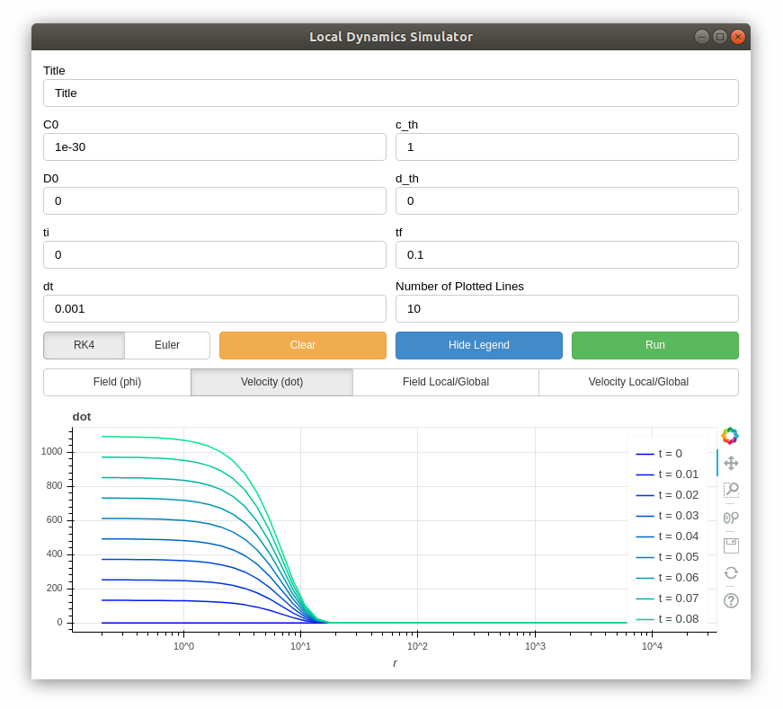

# local_dynamics_simulator
A simulator for the time evolution of scalar field disformally / conformally coupled to matter. Compares the local dynamics with the global evolution.
For more description of the theory and analysis, see the following:

- [Local Dynamics of Cosmological Scalar Fields (Bettoni,Heisenberg,Koivisto,Murakami,and Zumalacarregui: in prep)]() and
- [Screening Modifications of Gravity through Disformally Coupled Fields (Koivisto,Mota, and Zumalacarregui)](https://arxiv.org/abs/1205.3167).

------------------------------


### Dependencies
- bash
- pipenv (with python>=3.6)

-------------------------------

### Quick instruction
```$./install``` and then
```$./run```
(do ```$chmod +x``` if needed)

**IMPORTANT: closing server requires sudo password. This will be fixed as soon as possible.**

If the automatic run does not work:
```$pipenv shell``` and then ```$bokeh serve --show simulator.py```
(opens the simulator in your web browser)

Or:
```$pipenv shell``` and then ```$bokeh serve simulator.py```, followed by ```$python3 open_gui.py``` on another terminal to open the gui (this method allows the user to manually close the server by ```ctrl+c``` without superuser permission)

--------------------------
### Known issues
Following errors and warnings are known, but the simulator works perfectly.
- Server Startup:

```ImportError: No module named gi```
```ERROR:pywebview:GTK cannot be loaded```

This can be fixed by installing ``gi``:
(However, the package ```pywebview``` works with ```QT```, and ```GTK``` should not be needed)
```sudo apt install python-gi python-gi-cairo python3-gi python3-gi-cairo gir1.2-gtk-3.0 gir1.2-webkit2-4.0```

- Redrawing plots:

```WARNING:bokeh.document.document:Cannot apply patch to 1002 which is not in the document anymore```

This warning is raised when ```refresh_plot()``` is called in ```simulator.py```.
